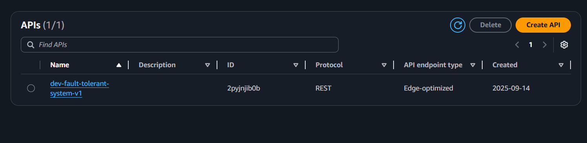
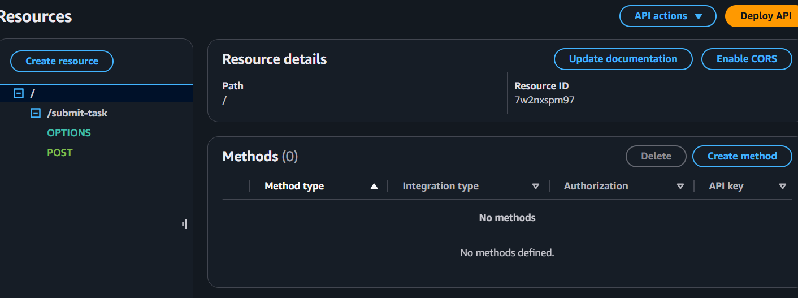
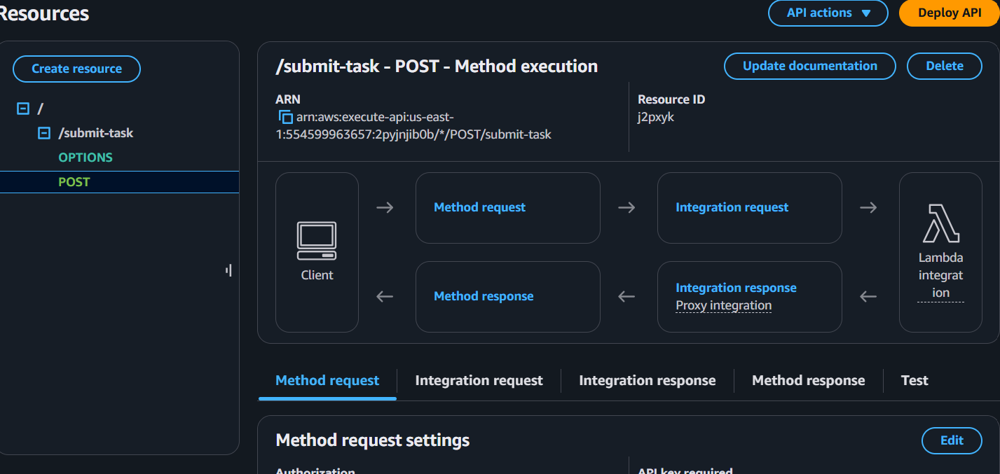

# Fault-Tolerant System v1

Zaprojektowałem i zaimplementowałem skalowalny i odporny na błędy system backendu w **Typescript**, oparty na architekturze event-driven. Aplikacja została zaimplementowana w dwóch wariantach: w pełni funkcjonalnym wdrożeniu na **AWS** oraz jako lokalna, niezależna od chmury symulacja z użyciem **Node.js** i **Express**. Dzięki temu rozwiązanie jest elastyczne i można je łatwo uruchomić zarówno w środowisku produkcyjnym, jak i do celów deweloperskich.

## 🚀 1. Wymagania wstępne

* **Node.js** (v14.x lub nowszy)
* **npm**
* **AWS CLI**
* **Serverless Framework**
* Skonfigurowane konto AWS z uprawnieniami do tworzenia zasobów (IAM, Lambda, SQS, API Gateway).

## 🛠️ 2. Instrukcje konfiguracji i wdrożenia na AWS

1.  **Zaloguj się** do konsoli AWS.
2.  Przejdź do serwisu **IAM** (Identity and Access Management).
3.  Stwórz nowego **użytkownika IAM** i nadaj mu uprawnienia `AdministratorAccess` (dla uproszczenia w celach deweloperskich).
4.  Wygeneruj **klucze dostępu** (Access Key ID i Secret Access Key) dla tego użytkownika.
5.  Zainstaluj **AWS CLI** i skonfiguruj go za pomocą wygenerowanych kluczy. Otwórz terminal i wprowadź:
    ```bash
    aws configure
    ```
    Postępuj zgodnie z instrukcjami, wprowadzając swoje klucze i wybierając domyślny region (np. `us-east-1`).

## ▶️ 3. Jak uruchumić i testować aplikację

3.1. Localnie:

1. Sklonuj repozytorium na swój komputer.
2. Przejdź do katalogu projektu w swoim terminalu.
3. Zainstaluj zależności projektu, które są potrzebne do działania aplikacji.
```Bash
npm install
```
4. Skompiluj kod TypeScript. Kompilator przetworzy pliki w katalogu local-dev i utworzy gotowy do uruchomienia kod JavaScript w folderze dist.

```Bash
npm run build
```
5. Uruchom serwer lokalnie. Powinieneś zobaczyć komunikat w terminalu, który potwierdza, że serwer jest uruchomiony i gotowy.

```Bash
npm start
```
6. Otwórz nowe okno terminala, aby wysłać zadanie do serwera. Przejdź do katalogu projektu i następnie wyszli następującą komendę:
```bash
Invoke-RestMethod -Uri http://localhost:3000/submit-task -Method Post -ContentType "application/json" -Body (Get-Content -Path task.json -Raw)
```
Uwaga: zawartość task.json można zmeniać.

3.2. AWS:

1.  Zainstaluj **Serverless Framework** globalnie:
    ```bash
    npm install -g serverless
    ```
2.  **Sklonuj** repozytorium na swój komputer.
3.  Przejdź do katalogu projektu.
4.  Zainstaluj zależności npm:
    ```bash
    npm install
    ```
5.  Jeśli używasz specyficznego profilu AWS, zdefiniuj go w pliku `serverless.yml`:
    ```yaml
    provider:
      name: aws
      profile: nazwa-twojego-profilu
      ...
    ```

---

6. Wdróż cały stos Serverless, uruchamiając komendę w katalogu projektu:
```bash
serverless deploy
```

## 🏗️ 4. Przegląd architektury

System składa się z trzech głównych komponentów w pełni zarządzanych przez AWS:

* **API Gateway**: Przyjmuje żądania POST do punktu końcowego `/submit-task` i przekazuje je do funkcji `submitTask`.
* **submitTask Lambda**: Funkcja Lambda, która przyjmuje zadanie, waliduje je i umieszcza wiadomość w kolejce SQS.
* **SQS (Simple Queue Service)**: Kolejka "TaskQueue" buforuje zadania. Jest połączona z kolejką DLQ (`DeadLetterQueue`) z polityką redrive, która ponawia próbę wykonania zadania 2 razy, zanim przeniesie je do DLQ.
* **processTask Lambda**: Funkcja, która nasłuchuje na "TaskQueue" i asynchronicznie przetwarza zadania. Symuluje błędy, aby przetestować odporność systemu na awarie.
* **dlqMonitor Lambda**: Funkcja, która monitoruje kolejkę DLQ i loguje szczegóły nieprzetworzonych zadań do CloudWatch, aby umożliwić ich dalszą inspekcję.


## 🧪 5. Instrukcje testowania

Aby przetestować system, użyj `curl` lub innej aplikacji, takiej jak Postman, aby wysłać żądanie POST do punktu końcowego API.

### Testowanie pomyślnego przetwarzania

Wyślij zadanie do API, aby zobaczyć, jak jest pomyślnie przetwarzane.

Lokalnie:
```bash
Invoke-RestMethod -Uri http://localhost:3000/submit-task -Method Post -ContentType "application/json" -Body (Get-Content -Path task.json -Raw)
````

AWS:
```bash
curl -X POST -H "Content-Type: application/json" -d '{"taskId": "test-1", "payload": {"user": "test-user", "action": "test-success"}}' [URL_TWOJEGO_API_GATEWAY]/submit-task
```
Aby zobaczyć pełne logi z testowania własnego, przejdź do: [submitTask.scv](logi/submitTask_logs.csv),  [processTask.scv](logi/processTask_logs.csv),  [dlqmonitor.scv](logi/dlqmonitor_logs.csv)

albo zobacz uporządkowane w tabeli wraz z wnioskami [pliku logów](test_logs.md).

 ## 🧠 6. Wkład sztucznej inteligencji
W ramach tego projektu wykorzystałem narzędzia AI jako asystenta programistycznego, co znacznie przyspieszyło proces tworzenia i optymalizacji kodu. Narzędzia te pomogły mi w generowaniu podstawowej architektury i plików konfiguracyjnych, efektywnym debugowaniu oraz tworzeniu czytelnej dokumentacji. Dzięki temu mogłem skupić się na rozwiązaniach kluczowych problemów, co jest zgodne z nowoczesnymi praktykami inżynierii oprogramowania.

## Rreview:






